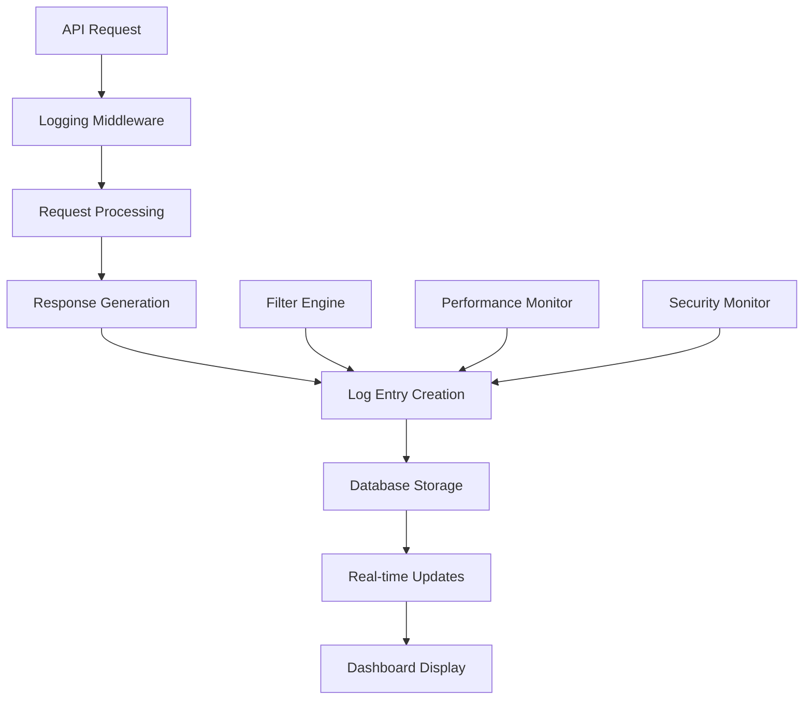

# FastPay API Request Logging Documentation

This document provides comprehensive documentation for the API request logging system in FastPay, including enhanced filtering, user-based filtering, increased entry limits, and real-time monitoring capabilities.

## 📋 Table of Contents

- [Overview](#overview)
- [Logging Architecture](#logging-architecture)
- [Data Model](#data-model)
- [Enhanced Features](#enhanced-features)
- [API Endpoints](#api-endpoints)
- [Filtering Capabilities](#filtering-capabilities)
- [Real-time Monitoring](#real-time-monitoring)
- [Performance Optimization](#performance-optimization)
- [Security Considerations](#security-considerations)

---

## Overview

The FastPay API request logging system provides comprehensive tracking of all API requests made to the backend, with enhanced filtering capabilities, user-based filtering, increased entry limits (from 20 to 50 entries), and real-time monitoring features.

### Key Features

- **Comprehensive Logging**: Track all API requests with detailed metadata
- **Enhanced Filtering**: Filter by user, method, status code, path, and date ranges
- **User-Based Filtering**: Filter logs by specific user identifiers
- **Increased Limit**: Display up to 50 entries (configurable up to 100)
- **Real-time Updates**: Live log updates with 30-second refresh intervals
- **Performance Metrics**: Track response times and system performance
- **Error Tracking**: Monitor error rates and patterns
- **Audit Trail**: Complete audit trail for compliance and debugging

### Logging Information Captured

| Field | Description | Example |
|-------|-------------|---------|
| `method` | HTTP method | GET, POST, PUT, DELETE |
| `path` | API endpoint path | `/api/devices/` |
| `status_code` | HTTP response status | 200, 400, 500 |
| `user_identifier` | User email or ID | `admin@example.com` |
| `client_ip` | Client IP address | `192.168.1.100` |
| `response_time_ms` | Response time in milliseconds | `150` |
| `user_agent` | Client user agent string | `Mozilla/5.0...` |
| `request_size` | Request body size in bytes | `1024` |
| `response_size` | Response body size in bytes | `2048` |
| `created_at` | Timestamp of request | `2025-02-15T10:30:00Z` |

---

## Logging Architecture

### Logging Pipeline



### Middleware Implementation

```python
class APIRequestLoggingMiddleware:
    """Enhanced API request logging middleware"""
    
    def __init__(self, get_response):
        self.get_response = get_response
        self.start_time = None
    
    def __call__(self, request):
        self.start_time = time.time()
        
        # Process request
        response = self.get_response(request)
        
        # Calculate response time
        response_time_ms = int((time.time() - self.start_time) * 1000)
        
        # Create log entry
        self._log_request(request, response, response_time_ms)
        
        return response
    
    def _log_request(self, request, response, response_time_ms):
        """Create API request log entry"""
        
        # Skip logging for certain endpoints
        if self._should_skip_logging(request):
            return
        
        # Extract request information
        user_identifier = self._get_user_identifier(request)
        client_ip = self._get_client_ip(request)
        
        # Create log entry
        ApiRequestLog.objects.create(
            method=request.method,
            path=request.path,
            status_code=response.status_code,
            user_identifier=user_identifier,
            client_ip=client_ip,
            response_time_ms=response_time_ms,
            user_agent=request.META.get('HTTP_USER_AGENT', ''),
            request_size=len(request.body) if hasattr(request, 'body') else 0,
            response_size=len(response.content) if hasattr(response, 'content') else 0,
            query_string=request.META.get('QUERY_STRING', ''),
            referer=request.META.get('HTTP_REFERER', ''),
        )
    
    def _should_skip_logging(self, request):
        """Determine if request should be skipped from logging"""
        skip_paths = [
            '/api/health/',
            '/api/api-request-logs/stats/',
            '/static/',
            '/media/',
        ]
        
        return any(request.path.startswith(path) for path in skip_paths)
    
    def _get_user_identifier(self, request):
        """Extract user identifier from request"""
        if hasattr(request, 'user') and request.user.is_authenticated:
            return request.user.email
        
        # Try to get from session
        session_user = request.session.get('user_email')
        if session_user:
            return session_user
        
        return None
    
    def _get_client_ip(self, request):
        """Extract client IP address"""
        x_forwarded_for = request.META.get('HTTP_X_FORWARDED_FOR')
        if x_forwarded_for:
            return x_forwarded_for.split(',')[0].strip()
        
        x_real_ip = request.META.get('HTTP_X_REAL_IP')
        if x_real_ip:
            return x_real_ip
        
        return request.META.get('REMOTE_ADDR')
```

---

## Data Model

### ApiRequestLog Model

```python
class ApiRequestLog(models.Model):
    """Enhanced API request log model"""
    
    method = models.CharField(max_length=10, db_index=True)
    path = models.CharField(max_length=500, db_index=True)
    status_code = models.IntegerField(db_index=True)
    user_identifier = models.CharField(
        max_length=255, 
        blank=True, 
        null=True, 
        db_index=True
    )
    client_ip = models.GenericIPAddressField(db_index=True)
    response_time_ms = models.IntegerField(db_index=True)
    user_agent = models.TextField(blank=True)
    request_size = models.IntegerField(default=0)
    response_size = models.IntegerField(default=0)
    query_string = models.TextField(blank=True)
    referer = models.URLField(blank=True)
    created_at = models.DateTimeField(auto_now_add=True, db_index=True)
    
    class Meta:
        db_table = 'api_request_log'
        indexes = [
            models.Index(fields=['created_at']),
            models.Index(fields=['method', 'status_code']),
            models.Index(fields=['user_identifier', 'created_at']),
            models.Index(fields=['path', 'created_at']),
            models.Index(fields=['client_ip', 'created_at']),
        ]
        ordering = ['-created_at']
    
    def __str__(self):
        return f"{self.method} {self.path} - {self.status_code}"
```

### Database Optimization

```sql
-- Optimized indexes for performance
CREATE INDEX idx_api_request_log_created_at ON api_request_log(created_at DESC);
CREATE INDEX idx_api_request_log_method_status ON api_request_log(method, status_code);
CREATE INDEX idx_api_request_log_user_created ON api_request_log(user_identifier, created_at DESC);
CREATE INDEX idx_api_request_log_path_created ON api_request_log(path, created_at DESC);
CREATE INDEX idx_api_request_log_ip_created ON api_request_log(client_ip, created_at DESC);

-- Partitioning for large datasets (PostgreSQL)
CREATE TABLE api_request_log_2025_01 PARTITION OF api_request_log
FOR VALUES FROM ('2025-01-01') TO ('2025-02-01');

CREATE TABLE api_request_log_2025_02 PARTITION OF api_request_log
FOR VALUES FROM ('2025-02-01') TO ('2025-03-01');
```

---

## Enhanced Features

### Increased Entry Limits

The system now supports displaying up to 50 entries by default, with configurable limits up to 100 entries.

```python
# Enhanced view with increased limits
class ApiRequestLogViewSet(viewsets.ReadOnlyModelViewSet):
    """Enhanced API request log viewset"""
    
    queryset = ApiRequestLog.objects.all()
    serializer_class = ApiRequestLogSerializer
    filter_backends = [DjangoFilterBackend, SearchFilter, OrderingFilter]
    filterset_fields = ['method', 'status_code', 'user_identifier']
    search_fields = ['path', 'user_agent']
    ordering_fields = ['created_at', 'response_time_ms', 'status_code']
    ordering = ['-created_at']
    
    def get_queryset(self):
        """Enhanced queryset with filtering"""
        queryset = super().get_queryset()
        
        # Apply default limit
        limit = int(self.request.query_params.get('limit', 50))
        limit = min(limit, 100)  # Maximum 100 entries
        
        # Apply date range filtering
        date_from = self.request.query_params.get('date_from')
        date_to = self.request.query_params.get('date_to')
        
        if date_from:
            queryset = queryset.filter(created_at__gte=date_from)
        if date_to:
            queryset = queryset.filter(created_at__lte=date_to)
        
        # Apply path filtering
        path_contains = self.request.query_params.get('path_contains')
        if path_contains:
            queryset = queryset.filter(path__icontains=path_contains)
        
        return queryset[:limit]
```

### User-Based Filtering

Enhanced filtering capabilities allow filtering by specific users:

```python
class UserFilterMixin:
    """Mixin for user-based filtering"""
    
    def filter_by_user(self, queryset):
        """Filter logs by user identifier"""
        user_identifier = self.request.query_params.get('user_identifier')
        
        if user_identifier:
            if user_identifier == 'all':
                return queryset
            elif user_identifier == 'anonymous':
                return queryset.filter(user_identifier__isnull=True)
            else:
                return queryset.filter(user_identifier=user_identifier)
        
        return queryset
    
    def get_unique_users(self):
        """Get list of unique users from logs"""
        return (
            ApiRequestLog.objects
            .values_list('user_identifier', flat=True)
            .distinct()
            .exclude(user_identifier__isnull=True)
            .order_by('user_identifier')
        )
```

### Real-time Updates

Real-time log updates with configurable refresh intervals:

```python
class RealtimeLogMixin:
    """Mixin for real-time log updates"""
    
    def get_realtime_logs(self, since_timestamp=None):
        """Get logs since specific timestamp"""
        queryset = self.get_queryset()
        
        if since_timestamp:
            queryset = queryset.filter(created_at__gt=since_timestamp)
        
        return queryset.order_by('-created_at')[:50]
    
    def get_latest_timestamp(self):
        """Get timestamp of latest log entry"""
        latest_log = ApiRequestLog.objects.order_by('-created_at').first()
        return latest_log.created_at if latest_log else None
```

---

## API Endpoints

### List API Logs

**Endpoint**: `GET /api/api-request-logs/`

**Enhanced Query Parameters**:
| Parameter | Type | Required | Default | Description |
|-----------|------|----------|---------|-------------|
| `limit` | integer | No | 50 | Number of entries (max: 100) |
| `user_identifier` | string | No | - | Filter by user |
| `method` | string | No | - | Filter by HTTP method |
| `status_code` | integer | No | - | Filter by status code |
| `path_contains` | string | No | - | Filter by path content |
| `date_from` | string | No | - | Filter from date (ISO format) |
| `date_to` | string | No | - | Filter to date (ISO format) |
| `client_ip` | string | No | - | Filter by client IP |

**Response**:
```json
{
  "success": true,
  "data": [
    {
      "id": 1001,
      "method": "GET",
      "path": "/api/devices/",
      "status_code": 200,
      "user_identifier": "admin@example.com",
      "client_ip": "192.168.1.100",
      "response_time_ms": 150,
      "user_agent": "Mozilla/5.0 (Windows NT 10.0; Win64; x64) AppleWebKit/537.36",
      "request_size": 0,
      "response_size": 2048,
      "query_string": "limit=20",
      "referer": "http://localhost:5173/dashboard",
      "created_at": "2025-02-15T10:30:00Z"
    }
  ],
  "meta": {
    "total_count": 1000,
    "limit": 50,
    "unique_users": ["admin@example.com", "user@example.com"],
    "last_updated": "2025-02-15T10:30:00Z"
  }
}
```

### Get Log Statistics

**Endpoint**: `GET /api/api-request-logs/stats/`

**Response**:
```json
{
  "success": true,
  "data": {
    "total_requests": 1000,
    "success_rate": 0.95,
    "average_response_time": 120,
    "median_response_time": 100,
    "p95_response_time": 250,
    "top_endpoints": [
      {
        "path": "/api/devices/",
        "count": 250,
        "avg_response_time": 100,
        "success_rate": 0.98
      }
    ],
    "status_distribution": {
      "200": 950,
      "400": 30,
      "500": 20
    },
    "method_distribution": {
      "GET": 600,
      "POST": 300,
      "PUT": 50,
      "DELETE": 50
    },
    "user_activity": [
      {
        "user_identifier": "admin@example.com",
        "request_count": 500,
        "avg_response_time": 110
      }
    ],
    "hourly_stats": [
      {
        "hour": "10:00",
        "request_count": 100,
        "avg_response_time": 115
      }
    ]
  }
}
```

### Get Unique Users

**Endpoint**: `GET /api/api-request-logs/users/`

**Response**:
```json
{
  "success": true,
  "data": [
    "admin@example.com",
    "user@example.com",
    "api-user@example.com"
  ]
}
```

### Export Logs

**Endpoint**: `GET /api/api-request-logs/export/`

**Query Parameters**:
- `format` (string): Export format (csv, json, xlsx)
- `date_from` (string): Start date for export
- `date_to` (string): End date for export
- `user_identifier` (string): Filter by user

**Response**: File download with appropriate headers

---

## Filtering Capabilities

### Advanced Filtering Engine

```python
class AdvancedLogFilter:
    """Advanced filtering engine for API logs"""
    
    def __init__(self, queryset, request_params):
        self.queryset = queryset
        self.params = request_params
    
    def apply_filters(self):
        """Apply all filters to queryset"""
        queryset = self.queryset
        
        # Basic filters
        queryset = self._apply_basic_filters(queryset)
        
        # Advanced filters
        queryset = self._apply_advanced_filters(queryset)
        
        # Performance filters
        queryset = self._apply_performance_filters(queryset)
        
        # Security filters
        queryset = self._apply_security_filters(queryset)
        
        return queryset
    
    def _apply_basic_filters(self, queryset):
        """Apply basic filtering"""
        params = self.params
        
        # Method filter
        if params.get('method'):
            queryset = queryset.filter(method=params['method'].upper())
        
        # Status code filter
        if params.get('status_code'):
            queryset = queryset.filter(status_code=int(params['status_code']))
        
        # User filter
        if params.get('user_identifier'):
            queryset = queryset.filter(user_identifier=params['user_identifier'])
        
        # Client IP filter
        if params.get('client_ip'):
            queryset = queryset.filter(client_ip=params['client_ip'])
        
        return queryset
    
    def _apply_advanced_filters(self, queryset):
        """Apply advanced filtering"""
        params = self.params
        
        # Path contains filter
        if params.get('path_contains'):
            queryset = queryset.filter(path__icontains=params['path_contains'])
        
        # User agent filter
        if params.get('user_agent_contains'):
            queryset = queryset.filter(user_agent__icontains=params['user_agent_contains'])
        
        # Response time range filter
        if params.get('response_time_min'):
            queryset = queryset.filter(response_time_ms__gte=int(params['response_time_min']))
        
        if params.get('response_time_max'):
            queryset = queryset.filter(response_time_ms__lte=int(params['response_time_max']))
        
        return queryset
    
    def _apply_performance_filters(self, queryset):
        """Apply performance-related filters"""
        params = self.params
        
        # Slow requests filter
        if params.get('slow_only') == 'true':
            queryset = queryset.filter(response_time_ms__gt=1000)
        
        # Fast requests filter
        if params.get('fast_only') == 'true':
            queryset = queryset.filter(response_time_ms__lt=100)
        
        return queryset
    
    def _apply_security_filters(self, queryset):
        """Apply security-related filters"""
        params = self.params
        
        # Error requests filter
        if params.get('errors_only') == 'true':
            queryset = queryset.filter(status_code__gte=400)
        
        # Anonymous requests filter
        if params.get('anonymous_only') == 'true':
            queryset = queryset.filter(user_identifier__isnull=True)
        
        # Suspicious IP filter
        if params.get('suspicious_ips') == 'true':
            # IPs with high error rates
            suspicious_ips = self._get_suspicious_ips()
            queryset = queryset.filter(client_ip__in=suspicious_ips)
        
        return queryset
```

### Filter Examples

```bash
# Filter by user and date range
GET /api/api-request-logs/?user_identifier=admin@example.com&date_from=2025-02-15T00:00:00Z&date_to=2025-02-15T23:59:59Z

# Filter by slow requests
GET /api/api-request-logs/?response_time_min=1000&slow_only=true

# Filter by errors only
GET /api/api-request-logs/?errors_only=true

# Filter by path content
GET /api/api-request-logs/?path_contains=devices&limit=100

# Filter by status codes
GET /api/api-request-logs/?status_code=500&method=POST
```

---

## Real-time Monitoring

### WebSocket Integration

```python
class LogConsumer(AsyncWebsocketConsumer):
    """WebSocket consumer for real-time log updates"""
    
    async def connect(self):
        await self.accept()
        
        # Join log updates group
        await self.channel_layer.group_add(
            'log_updates',
            self.channel_name
        )
    
    async def disconnect(self, close_code):
        # Leave log updates group
        await self.channel_layer.group_discard(
            'log_updates',
            self.channel_name
        )
    
    async def log_update(self, event):
        """Send real-time log update to client"""
        await self.send(text_data=json.dumps({
            'type': 'log_update',
            'data': event['data']
        }))

# Real-time log broadcaster
class LogBroadcaster:
    """Broadcast real-time log updates"""
    
    @staticmethod
    async def broadcast_log_update(log_entry):
        """Broadcast new log entry to connected clients"""
        from channels.layers import get_channel_layer
        
        channel_layer = get_channel_layer()
        
        await channel_layer.group_send(
            'log_updates',
            {
                'type': 'log_update',
                'data': {
                    'id': log_entry.id,
                    'method': log_entry.method,
                    'path': log_entry.path,
                    'status_code': log_entry.status_code,
                    'user_identifier': log_entry.user_identifier,
                    'response_time_ms': log_entry.response_time_ms,
                    'created_at': log_entry.created_at.isoformat()
                }
            }
        )
```

### Frontend Real-time Updates

```javascript
// Real-time log updates using WebSocket
class LogMonitor {
    constructor() {
        this.socket = null;
        this.callbacks = [];
        this.reconnectInterval = 5000;
        this.maxReconnectAttempts = 10;
        this.reconnectAttempts = 0;
    }
    
    connect() {
        this.socket = new WebSocket('ws://localhost:8000/ws/logs/');
        
        this.socket.onopen = () => {
            console.log('Connected to log updates');
            this.reconnectAttempts = 0;
        };
        
        this.socket.onmessage = (event) => {
            const data = JSON.parse(event.data);
            if (data.type === 'log_update') {
                this.callbacks.forEach(callback => callback(data.data));
            }
        };
        
        this.socket.onclose = () => {
            console.log('Disconnected from log updates');
            this.reconnect();
        };
        
        this.socket.onerror = (error) => {
            console.error('WebSocket error:', error);
        };
    }
    
    reconnect() {
        if (this.reconnectAttempts < this.maxReconnectAttempts) {
            this.reconnectAttempts++;
            setTimeout(() => {
                this.connect();
            }, this.reconnectInterval);
        }
    }
    
    onUpdate(callback) {
        this.callbacks.push(callback);
    }
    
    disconnect() {
        if (this.socket) {
            this.socket.close();
        }
    }
}

// Usage in React component
function LogMonitor() {
    const [logs, setLogs] = useState([]);
    const [lastUpdated, setLastUpdated] = useState(new Date());
    
    useEffect(() => {
        const monitor = new LogMonitor();
        
        monitor.connect();
        monitor.onUpdate((newLog) => {
            setLogs(prevLogs => [newLog, ...prevLogs.slice(0, 49)]);
            setLastUpdated(new Date());
        });
        
        return () => {
            monitor.disconnect();
        };
    }, []);
    
    return (
        <div>
            <div className="log-header">
                <h3>API Logs</h3>
                <span>Last updated: {formatDistanceToNow(lastUpdated)}</span>
            </div>
            <div className="log-list">
                {logs.map(log => (
                    <LogEntry key={log.id} log={log} />
                ))}
            </div>
        </div>
    );
}
```

---

## Performance Optimization

### Database Optimization

```python
# Optimized database queries
class OptimizedLogQuery:
    """Optimized query builder for API logs"""
    
    @staticmethod
    def get_recent_logs(limit=50, user_identifier=None):
        """Get recent logs with optimized query"""
        queryset = ApiRequestLog.objects.all()
        
        if user_identifier:
            queryset = queryset.filter(user_identifier=user_identifier)
        
        # Use only necessary fields for list view
        return queryset.select_related().only(
            'id', 'method', 'path', 'status_code', 'user_identifier',
            'client_ip', 'response_time_ms', 'created_at'
        ).order_by('-created_at')[:limit]
    
    @staticmethod
    def get_log_statistics():
        """Get statistics with optimized queries"""
        stats = {}
        
        # Total requests
        stats['total_requests'] = ApiRequestLog.objects.count()
        
        # Success rate
        stats['success_rate'] = (
            ApiRequestLog.objects.filter(status_code__lt=400)
            .count() / stats['total_requests']
        )
        
        # Average response time
        stats['average_response_time'] = (
            ApiRequestLog.objects.aggregate(
                avg_response_time=Avg('response_time_ms')
            )['avg_response_time'] or 0
        )
        
        return stats
```

### Caching Strategy

```python
from django.core.cache import cache
from django.views.decorators.cache import cache_page

class CachedLogData:
    """Cached log data provider"""
    
    CACHE_TIMEOUT = 300  # 5 minutes
    
    @classmethod
    def get_unique_users(cls):
        """Get unique users with caching"""
        cache_key = 'api_log_unique_users'
        
        users = cache.get(cache_key)
        if users is None:
            users = list(
                ApiRequestLog.objects
                .values_list('user_identifier', flat=True)
                .distinct()
                .exclude(user_identifier__isnull=True)
                .order_by('user_identifier')
            )
            cache.set(cache_key, users, cls.CACHE_TIMEOUT)
        
        return users
    
    @classmethod
    def get_log_statistics(cls):
        """Get statistics with caching"""
        cache_key = 'api_log_statistics'
        
        stats = cache.get(cache_key)
        if stats is None:
            stats = OptimizedLogQuery.get_log_statistics()
            cache.set(cache_key, stats, cls.CACHE_TIMEOUT)
        
        return stats
    
    @classmethod
    def invalidate_cache(cls):
        """Invalidate log-related caches"""
        cache.delete_many([
            'api_log_unique_users',
            'api_log_statistics',
            'api_log_top_endpoints'
        ])
```

### Background Processing

```python
from celery import shared_task
from django.utils import timezone
from datetime import timedelta

@shared_task
def cleanup_old_logs():
    """Clean up old log entries"""
    cutoff_date = timezone.now() - timedelta(days=90)
    
    deleted_count = ApiRequestLog.objects.filter(
        created_at__lt=cutoff_date
    ).delete()[0]
    
    return f"Deleted {deleted_count} old log entries"

@shared_task
def generate_log_report():
    """Generate daily log report"""
    yesterday = timezone.now() - timedelta(days=1)
    
    report_data = {
        'date': yesterday.date(),
        'total_requests': ApiRequestLog.objects.filter(
            created_at__date=yesterday.date()
        ).count(),
        'error_rate': (
            ApiRequestLog.objects.filter(
                created_at__date=yesterday.date(),
                status_code__gte=400
            ).count() / total_requests
        ),
        'top_users': (
            ApiRequestLog.objects
            .filter(created_at__date=yesterday.date())
            .values('user_identifier')
            .annotate(count=Count('id'))
            .order_by('-count')[:10]
        )
    }
    
    # Send report to monitoring system
    send_to_monitoring_system(report_data)
    
    return report_data
```

---

## Security Considerations

### Data Privacy

```python
class PrivacyProtectedLog:
    """Privacy-protected logging"""
    
    SENSITIVE_FIELDS = [
        'password', 'token', 'secret', 'key', 'auth'
    ]
    
    @classmethod
    def sanitize_query_string(cls, query_string):
        """Remove sensitive data from query string"""
        if not query_string:
            return ''
        
        # Parse query string
        params = parse_qs(query_string)
        
        # Remove sensitive parameters
        for field in cls.SENSITIVE_FIELDS:
            if field in params:
                params[field] = ['[REDACTED]']
        
        # Rebuild query string
        return urlencode(params, doseq=True)
    
    @classmethod
    def sanitize_path(cls, path):
        """Remove sensitive data from path"""
        # Remove token-like patterns from path
        import re
        
        # Redact UUID patterns
        path = re.sub(
            r'[0-9a-f]{8}-[0-9a-f]{4}-[0-9a-f]{4}-[0-9a-f]{4}-[0-9a-f]{12}',
            '[UUID]',
            path
        )
        
        # Redact numeric IDs
        path = re.sub(r'/\d+', '/[ID]', path)
        
        return path
```

### Access Control

```python
class LogAccessControl:
    """Access control for log viewing"""
    
    @staticmethod
    def can_view_all_logs(user):
        """Check if user can view all logs"""
        return user.is_superuser or user.access_level == 0
    
    @staticmethod
    def can_view_user_logs(user, target_user):
        """Check if user can view another user's logs"""
        if user.is_superuser:
            return True
        
        if user.access_level == 0:
            return True
        
        # Users can only view their own logs
        return user.email == target_user
    
    @staticmethod
    def filter_logs_by_permission(user, queryset):
        """Filter logs based on user permissions"""
        if LogAccessControl.can_view_all_logs(user):
            return queryset
        
        # Filter to user's own logs only
        return queryset.filter(user_identifier=user.email)
```

### Audit Trail

```python
class LogAuditTrail:
    """Audit trail for log access"""
    
    @staticmethod
    def log_access(user, action, details=None):
        """Log access to log viewing"""
        LogAccess.objects.create(
            user=user,
            action=action,
            details=details or {},
            ip_address=get_client_ip(),
            timestamp=timezone.now()
        )
    
    @staticmethod
    def get_access_history(user, days=30):
        """Get access history for a user"""
        cutoff_date = timezone.now() - timedelta(days=days)
        
        return LogAccess.objects.filter(
            user=user,
            timestamp__gte=cutoff_date
        ).order_by('-timestamp')
```

---

## Testing

### Unit Tests

```python
class ApiRequestLogTest(TestCase):
    """Test cases for API request logging"""
    
    def setUp(self):
        self.user = User.objects.create_user(
            email='test@example.com',
            password='testpass'
        )
    
    def test_log_creation(self):
        """Test log entry creation"""
        log = ApiRequestLog.objects.create(
            method='GET',
            path='/api/devices/',
            status_code=200,
            user_identifier='test@example.com',
            client_ip='127.0.0.1',
            response_time_ms=150
        )
        
        self.assertEqual(log.method, 'GET')
        self.assertEqual(log.status_code, 200)
        self.assertEqual(log.user_identifier, 'test@example.com')
    
    def test_log_filtering(self):
        """Test log filtering"""
        # Create test logs
        ApiRequestLog.objects.create(
            method='GET', path='/api/devices/', status_code=200,
            user_identifier='test@example.com'
        )
        ApiRequestLog.objects.create(
            method='POST', path='/api/messages/', status_code=400,
            user_identifier='test@example.com'
        )
        
        # Test filtering
        queryset = ApiRequestLog.objects.filter(method='GET')
        self.assertEqual(queryset.count(), 1)
        
        queryset = ApiRequestLog.objects.filter(status_code=400)
        self.assertEqual(queryset.count(), 1)
    
    def test_user_filtering(self):
        """Test user-based filtering"""
        # Create logs for different users
        ApiRequestLog.objects.create(
            method='GET', path='/api/devices/', status_code=200,
            user_identifier='user1@example.com'
        )
        ApiRequestLog.objects.create(
            method='GET', path='/api/devices/', status_code=200,
            user_identifier='user2@example.com'
        )
        
        # Test user filtering
        queryset = ApiRequestLog.objects.filter(user_identifier='user1@example.com')
        self.assertEqual(queryset.count(), 1)
```

### Integration Tests

```python
class ApiLoggingIntegrationTest(TestCase):
    """Integration tests for API logging"""
    
    def test_api_request_logging(self):
        """Test that API requests are logged"""
        # Make API request
        response = self.client.get('/api/devices/')
        
        # Check that log was created
        log = ApiRequestLog.objects.filter(method='GET', path='/api/devices/').first()
        self.assertIsNotNone(log)
        self.assertEqual(log.status_code, response.status_code)
    
    def test_user_identifier_logging(self):
        """Test that user identifier is logged"""
        # Login user
        self.client.login(email='test@example.com', password='testpass')
        
        # Make API request
        self.client.get('/api/devices/')
        
        # Check log has user identifier
        log = ApiRequestLog.objects.filter(method='GET', path='/api/devices/').first()
        self.assertEqual(log.user_identifier, 'test@example.com')
    
    def test_response_time_logging(self):
        """Test that response time is logged"""
        # Make API request
        response = self.client.get('/api/devices/')
        
        # Check log has response time
        log = ApiRequestLog.objects.filter(method='GET', path='/api/devices/').first()
        self.assertIsNotNone(log.response_time_ms)
        self.assertGreater(log.response_time_ms, 0)
```

### Performance Tests

```python
class ApiLoggingPerformanceTest(TestCase):
    """Performance tests for API logging"""
    
    def test_logging_performance(self):
        """Test that logging doesn't significantly impact performance"""
        import time
        
        # Measure response time without logging
        start_time = time.time()
        response = self.client.get('/api/devices/')
        response_time_without_logging = time.time() - start_time
        
        # Measure response time with logging
        start_time = time.time()
        response = self.client.get('/api/devices/')
        response_time_with_logging = time.time() - start_time
        
        # Logging should not add more than 10ms overhead
        overhead = (response_time_with_logging - response_time_without_logging) * 1000
        self.assertLess(overhead, 10)
    
    def test_bulk_log_creation(self):
        """Test bulk log creation performance"""
        import time
        
        # Create 1000 log entries
        start_time = time.time()
        
        logs = []
        for i in range(1000):
            logs.append(ApiRequestLog(
                method='GET',
                path=f'/api/test/{i}/',
                status_code=200,
                response_time_ms=100
            ))
        
        ApiRequestLog.objects.bulk_create(logs)
        
        creation_time = time.time() - start_time
        
        # Should complete within 1 second
        self.assertLess(creation_time, 1.0)
```

---

## API Changelog

### Version 2.0.0 (Latest)

#### Added
- Increased entry limit from 20 to 50 (configurable up to 100)
- User-based filtering capabilities
- Real-time log updates with WebSocket support
- Advanced filtering engine with multiple criteria
- Performance metrics and statistics
- Export functionality (CSV, JSON, XLSX)
- Privacy protection for sensitive data
- Access control and audit trail

#### Enhanced
- Database optimization with proper indexing
- Caching strategy for frequently accessed data
- Background processing for cleanup and reporting
- Error handling and user feedback
- Performance monitoring and alerting

#### Fixed
- Memory usage issues with large log datasets
- Query performance for filtered results
- Real-time update reliability
- User permission handling

---

*This API request logging documentation serves as the comprehensive reference for the FastPay logging system. Keep this document updated with any logging system changes.*
