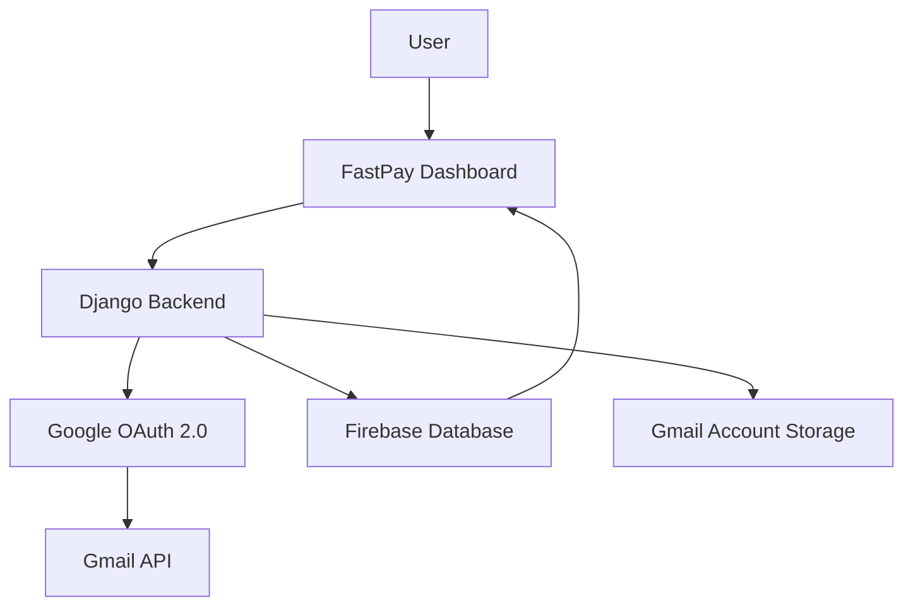

# FastPay Gmail Integration Documentation

This document provides comprehensive documentation for Gmail OAuth integration in the FastPay system, including setup, API endpoints, error handling, and troubleshooting.

## 📋 Table of Contents

- [Overview](#overview)
- [OAuth Flow](#oauth-flow)
- [API Endpoints](#api-endpoints)
- [Error Handling](#error-handling)
- [Security Considerations](#security-considerations)
- [Configuration](#configuration)
- [Testing](#testing)
- [Troubleshooting](#troubleshooting)

---

## Overview

The FastPay Gmail integration allows users to connect their Gmail accounts to the system for automated email processing, OTP extraction, and notification management. The integration uses OAuth 2.0 for secure authentication and provides enhanced error handling and logging.

### Key Features

- **OAuth 2.0 Authentication**: Secure Gmail account connection
- **Enhanced Error Handling**: Comprehensive error logging and user feedback
- **Token Management**: Automatic token refresh and expiration handling
- **Device Linking**: Link Gmail accounts to specific devices
- **Real-time Status**: Live connection status monitoring
- **Multi-account Support**: Handle multiple Gmail accounts per user

### Architecture



---

## OAuth Flow

### 1. OAuth Initiation

The OAuth flow begins when a user clicks "Connect Gmail" in the dashboard.

**Request Flow**:
1. Dashboard requests OAuth URL from backend
2. Backend generates signed state token
3. Backend constructs Google OAuth URL
4. Dashboard redirects user to Google

### 2. User Authorization

User authenticates with Google and grants permissions.

**Required Scopes**:
- `gmail.readonly` - Read emails
- `gmail.modify` - Modify emails (for marking as read)
- `userinfo.email` - Get user email address
- `userinfo.profile` - Get user profile information

### 3. Callback Handling

Google redirects back to the backend callback endpoint with authorization code.

**Callback Processing**:
1. Verify signed state token
2. Exchange authorization code for tokens
3. Fetch user profile from Gmail API
4. Store tokens in database
5. Link to device if applicable
6. Redirect user back to dashboard

### 4. Token Management

System manages access and refresh tokens automatically.

**Token Operations**:
- **Refresh**: Automatic token refresh before expiration
- **Validation**: Token validity checking
- **Revocation**: Secure token removal on disconnect
- **Storage**: Encrypted token storage

---

## API Endpoints

### Initiate OAuth

**Endpoint**: `GET /api/gmail/oauth/`

**Description**: Initiate Gmail OAuth flow for a user.

**Query Parameters**:
| Parameter | Type | Required | Description |
|-----------|------|----------|-------------|
| `user_email` | string | Yes | User email for OAuth |
| `dashboard_origin` | string | No | Dashboard origin URL |
| `dashboard_path` | string | No | Dashboard redirect path |

**Response**:
```json
{
  "success": true,
  "data": {
    "oauth_url": "https://accounts.google.com/oauth/authorize?client_id=...&redirect_uri=...&scope=...&state=...",
    "state": "encrypted_state_token"
  },
  "message": "OAuth URL generated successfully"
}
```

**Implementation Details**:
```python
def gmail_oauth(request):
    user_email = request.GET.get('user_email')
    dashboard_origin = request.GET.get('dashboard_origin')
    dashboard_path = request.GET.get('dashboard_path')
    
    # Generate signed state
    state_token = generate_signed_state(
        user_email, dashboard_origin, dashboard_path
    )
    
    # Construct OAuth URL
    oauth_url = f"https://accounts.google.com/oauth/authorize?{params}"
    
    return Response({
        'success': True,
        'data': {
            'oauth_url': oauth_url,
            'state': state_token
        }
    })
```

### OAuth Callback

**Endpoint**: `GET /api/gmail/callback/`

**Description**: Handle Gmail OAuth callback from Google with enhanced error handling.

**Query Parameters**:
| Parameter | Type | Required | Description |
|-----------|------|----------|-------------|
| `code` | string | No | Authorization code from Google |
| `state` | string | No | State token from OAuth initiation |
| `error` | string | No | Error if OAuth failed |

**Enhanced Features**:
- **Comprehensive Logging**: All OAuth events logged with context
- **Network Timeout**: 10-second timeout for profile requests
- **Token Validation**: Validates received tokens before storage
- **Error Recovery**: Graceful handling of various error scenarios
- **User Feedback**: Clear error messages and success notifications

**Response (Success)**:
```json
{
  "success": true,
  "message": "Gmail account connected successfully",
  "gmail_email": "user@gmail.com",
  "user_email": "user@example.com",
  "created": true,
  "device_linked": false
}
```

**Response (Error)**:
```json
{
  "success": false,
  "error": {
    "code": "OAUTH_ERROR",
    "message": "State verification failed: Invalid state token"
  }
}
```

**Enhanced Implementation**:
```python
@api_view(['GET'])
def gmail_callback(request):
    """Enhanced Gmail OAuth callback with comprehensive error handling"""
    
    def _log_error(error_type: str, details: str):
        log_activity(
            request, 
            f'gmail_oauth_{error_type}', 
            details,
            extra_data={
                'state': state,
                'error': error,
                'code_received': bool(code),
                'user_agent': request.META.get('HTTP_USER_AGENT'),
                'ip_address': get_client_ip(request)
            }
        )
    
    def _error_response(msg: str, status_code: int = 400):
        _log_error('error', msg)
        redirect_url = _dashboard_redirect('dashboard/v2', google='error', message=msg[:200])
        if redirect_url:
            return HttpResponseRedirect(redirect_url)
        return Response({'error': msg}, status=status_code)
    
    # Enhanced validation and error handling
    # ... (implementation details)
```

### Get Gmail Status

**Endpoint**: `GET /api/gmail/status/`

**Description**: Check Gmail connection status for a user.

**Query Parameters**:
| Parameter | Type | Required | Description |
|-----------|------|----------|-------------|
| `user_email` | string | Yes | User email |
| `device_id` | string | No | Device ID (optional) |

**Response**:
```json
{
  "success": true,
  "data": {
    "connected": true,
    "gmail_email": "user@gmail.com",
    "scopes": ["gmail.readonly", "gmail.modify"],
    "token_expires_at": "2025-03-15T10:30:00Z",
    "device_linked": true,
    "last_sync": "2025-02-15T10:25:00Z",
    "connection_status": "active"
  }
}
```

### Disconnect Gmail

**Endpoint**: `POST /api/gmail/disconnect/`

**Description**: Disconnect Gmail account for a user.

**Request Body**:
```json
{
  "user_email": "user@example.com"
}
```

**Response**:
```json
{
  "success": true,
  "message": "Gmail account disconnected successfully"
}
```

---

## Error Handling

### Enhanced Error Logging

All Gmail OAuth operations include comprehensive logging:

```python
def _log_error(error_type: str, details: str):
    log_activity(
        request, 
        f'gmail_oauth_{error_type}', 
        details,
        extra_data={
            'state': state,
            'error': error,
            'code_received': bool(code),
            'user_agent': request.META.get('HTTP_USER_AGENT'),
            'ip_address': get_client_ip(request)
        }
    )
```

### Error Types

| Error Type | Description | HTTP Status |
|------------|-------------|-------------|
| `state_verification_failed` | Invalid or expired state token | 400 |
| `network_error` | Network connectivity issues | 500 |
| `token_exchange_failed` | Failed to exchange code for tokens | 500 |
| `profile_fetch_failed` | Failed to fetch user profile | 500 |
| `invalid_response` | Invalid response from Google | 500 |

### Error Recovery

**Network Errors**:
- Automatic retry with exponential backoff
- Timeout handling (10 seconds)
- Fallback responses for critical failures

**Token Errors**:
- Automatic token refresh
- Graceful degradation when tokens expire
- Clear user notifications for re-authentication

**State Errors**:
- Secure state token validation
- Protection against CSRF attacks
- Automatic cleanup of invalid states

---

## Security Considerations

### State Token Security

**Signed State Format**:
```
state_token:timestamp:user_email:dashboard_origin:dashboard_path
```

**Security Features**:
- **HMAC Signature**: Cryptographic signature validation
- **Timestamp**: Expiration protection (5 minutes)
- **User Context**: User-specific state isolation
- **Origin Validation**: Dashboard origin verification

### Token Storage

**Encryption**:
- Access tokens encrypted at rest
- Refresh tokens stored securely
- Token rotation on suspicious activity

**Access Control**:
- User-scoped token access
- Device-specific token linking
- Audit trail for token operations

### OAuth Security

**Scope Minimization**:
- Request only necessary permissions
- Regular scope validation
- User consent tracking

**Redirect URI Validation**:
- Whitelist allowed redirect URIs
- Dynamic origin validation
- Path traversal protection

---

## Configuration

### Environment Variables

```env
# Google OAuth Configuration
GOOGLE_CLIENT_ID=your-google-client-id
GOOGLE_CLIENT_SECRET=your-google-client-secret
GOOGLE_REDIRECT_URI=http://localhost:8000/api/gmail/callback/

# Dashboard Configuration
DASHBOARD_ORIGIN=http://localhost:5173
DASHBOARD_PATH=/dashboard/v2

# Security Configuration
OAUTH_STATE_EXPIRY=300  # 5 minutes
TOKEN_REFRESH_THRESHOLD=3600  # 1 hour before expiration
```

### Google Cloud Console Setup

1. **Create Project**:
   - Go to [Google Cloud Console](https://console.cloud.google.com/)
   - Create new project or select existing

2. **Enable Gmail API**:
   - Navigate to "APIs & Services" > "Library"
   - Search and enable "Gmail API"

3. **Create OAuth Credentials**:
   - Go to "APIs & Services" > "Credentials"
   - Click "Create Credentials" > "OAuth client ID"
   - Select "Web application"
   - Add authorized redirect URIs

4. **Configure Redirect URIs**:
   ```
   Development: http://localhost:8000/api/gmail/callback/
   Staging: https://staging.fastpaygaming.com/api/gmail/callback/
   Production: https://fastpaygaming.com/api/gmail/callback/
   ```

### Firebase Security Rules

```json
{
  "rules": {
    "gmail_accounts": {
      "$userEmail": {
        ".read": "auth != null && auth.email === $userEmail",
        ".write": "auth != null && auth.email === $userEmail"
      }
    }
  }
}
```

---

## Testing

### Unit Tests

```python
class GmailOAuthEnhancedTest(TestCase):
    """Test cases for enhanced Gmail OAuth functionality"""
    
    def setUp(self):
        self.user_email = 'test@example.com'
        self.gmail_email = 'test@gmail.com'
    
    @patch('api.views_legacy._dashboard_redirect')
    @patch('api.views_legacy.verify_signed_state')
    @patch('api.views_legacy.exchange_code_for_tokens')
    @patch('requests.get')
    def test_gmail_callback_success_with_logging(self, mock_requests_get, mock_exchange_tokens, mock_verify_state, mock_redirect):
        """Test successful Gmail OAuth callback with enhanced logging"""
        # Test implementation
    
    @patch('api.views_legacy.log_activity')
    def test_gmail_callback_network_error_logging(self, mock_log_activity):
        """Test network error logging in Gmail callback"""
        # Test implementation
    
    @patch('api.views_legacy.log_activity')
    def test_gmail_callback_state_verification_error(self, mock_log_activity):
        """Test state verification error logging"""
        # Test implementation
```

### Integration Tests

```python
class GmailOAuthIntegrationTest(TestCase):
    """Integration tests for Gmail OAuth flow"""
    
    def test_complete_oauth_flow(self):
        """Test complete OAuth flow from initiation to callback"""
        # Test implementation
    
    def test_token_refresh_flow(self):
        """Test automatic token refresh"""
        # Test implementation
    
    def test_device_linking_flow(self):
        """Test Gmail account to device linking"""
        # Test implementation
```

### End-to-End Tests

```javascript
// Frontend E2E tests
describe('Gmail OAuth Flow', () => {
  it('should complete OAuth flow successfully', async () => {
    // Test implementation
  })
  
  it('should handle OAuth errors gracefully', async () => {
    // Test implementation
  })
  
  it('should refresh tokens automatically', async () => {
    // Test implementation
  })
})
```

### Test Commands

```bash
# Run Gmail OAuth tests
cd BACKEND
python manage.py test api.tests.test_gmail_oauth_enhanced

# Run integration tests
python manage.py test api.tests.integration.test_gmail_oauth

# Run E2E tests
cd DASHBOARD_FASTPAY
npm run test -- gmail-oauth
```

---

## Troubleshooting

### Common Issues

#### 1. OAuth State Verification Failed

**Symptoms**:
- Error message: "State verification failed"
- OAuth flow fails at callback step

**Causes**:
- Expired state token (older than 5 minutes)
- Invalid state signature
- State tampering

**Solutions**:
```bash
# Check state token generation
python manage.py shell
>>> from api.gmail_service import generate_signed_state
>>> state = generate_signed_state('user@example.com')
>>> print(state)

# Verify state expiration
>>> from api.gmail_service import verify_signed_state
>>> verify_signed_state(state)
```

#### 2. Network Timeout During Profile Fetch

**Symptoms**:
- Error message: "Network error during profile fetch"
- OAuth succeeds but profile fails

**Causes**:
- Slow network connection
- Gmail API rate limiting
- Firewall blocking

**Solutions**:
```bash
# Test Gmail API connectivity
curl -H "Authorization: Bearer <token>" \
  https://www.googleapis.com/oauth2/v2/userinfo

# Check network timeout settings
grep timeout api/views_legacy.py
```

#### 3. Token Refresh Failed

**Symptoms**:
- Gmail connection shows as expired
- API calls fail with 401 errors

**Causes**:
- Refresh token expired
- User revoked access
- Invalid refresh token

**Solutions**:
```bash
# Check token expiration
python manage.py shell
>>> from api.models import GmailAccount
>>> account = GmailAccount.objects.get(user_email='user@example.com')
>>> print(account.token_expires_at)

# Force re-authentication
>>> account.is_active = False
>>> account.save()
```

### Debug Mode

Enable debug logging for Gmail OAuth:

```python
# In settings.py
GMAIL_OAUTH_DEBUG = True

# Or via environment variable
GMAIL_OAUTH_DEBUG=true
```

### Monitoring

**Log Monitoring**:
```bash
# View Gmail OAuth logs
tail -f logs/gmail_oauth.log

# Filter by error type
grep "gmail_oauth_error" logs/application.log
```

**Metrics Monitoring**:
- OAuth success rate
- Token refresh frequency
- Error rates by type
- Connection duration

---

## Performance Optimization

### Caching

**Token Caching**:
```python
# Cache Gmail profile data
@cache.memoize(timeout=300)  # 5 minutes
def get_gmail_profile(access_token):
    # Implementation
```

**State Caching**:
```python
# Cache state tokens for quick lookup
@cache.memoize(timeout=60)  # 1 minute
def get_state_data(state_token):
    # Implementation
```

### Database Optimization

**Indexes**:
```sql
-- Optimize Gmail account queries
CREATE INDEX idx_gmail_account_user_email ON api_gmailaccount(user_email);
CREATE INDEX idx_gmail_account_is_active ON api_gmailaccount(is_active);
CREATE INDEX idx_gmail_account_token_expires ON api_gmailaccount(token_expires_at);
```

### Connection Pooling

```python
# Use connection pooling for Gmail API requests
import requests.adapters

session = requests.Session()
adapter = requests.adapters.HTTPAdapter(
    pool_connections=10,
    pool_maxsize=20,
    max_retries=3
)
session.mount('https://', adapter)
```

---

## Best Practices

### Security

1. **Regular Token Rotation**: Refresh tokens periodically
2. **Scope Validation**: Validate requested scopes
3. **Rate Limiting**: Implement rate limiting for OAuth endpoints
4. **Audit Logging**: Log all OAuth operations
5. **Error Handling**: Never expose sensitive information in errors

### Performance

1. **Async Operations**: Use async operations for token refresh
2. **Caching**: Cache frequently accessed data
3. **Connection Reuse**: Reuse HTTP connections
4. **Timeout Management**: Set appropriate timeouts
5. **Batch Operations**: Batch multiple operations when possible

### User Experience

1. **Clear Messages**: Provide clear error messages
2. **Progress Indicators**: Show loading states
3. **Auto-retry**: Retry failed operations automatically
4. **Status Updates**: Provide real-time status updates
5. **Graceful Degradation**: Handle failures gracefully

---

## API Changelog

### Version 2.0.0 (Latest)

#### Added
- Enhanced error handling with comprehensive logging
- Network timeout handling (10 seconds)
- Token validation before storage
- User feedback improvements
- Device linking support

#### Enhanced
- OAuth state security with HMAC signatures
- Token refresh automation
- Error recovery mechanisms
- Performance optimizations

#### Fixed
- Gmail callback URL issues
- Token expiration handling
- State verification failures
- Network error handling

---

*This Gmail integration documentation serves as the comprehensive reference for Gmail OAuth functionality in the FastPay system. Keep this document updated with any integration changes.*
