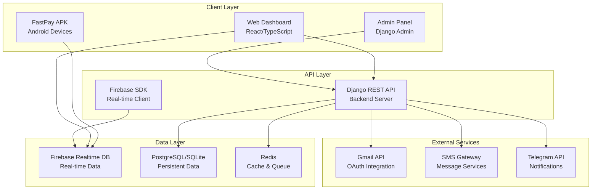
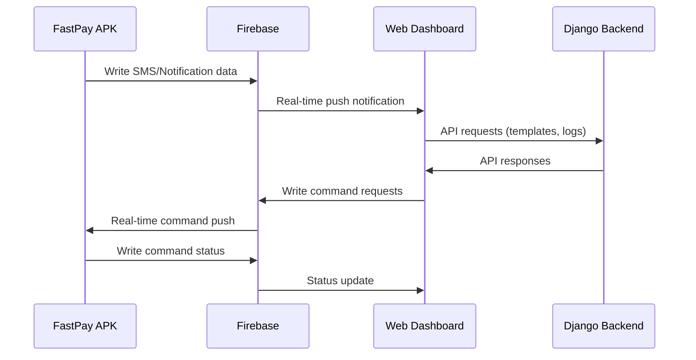
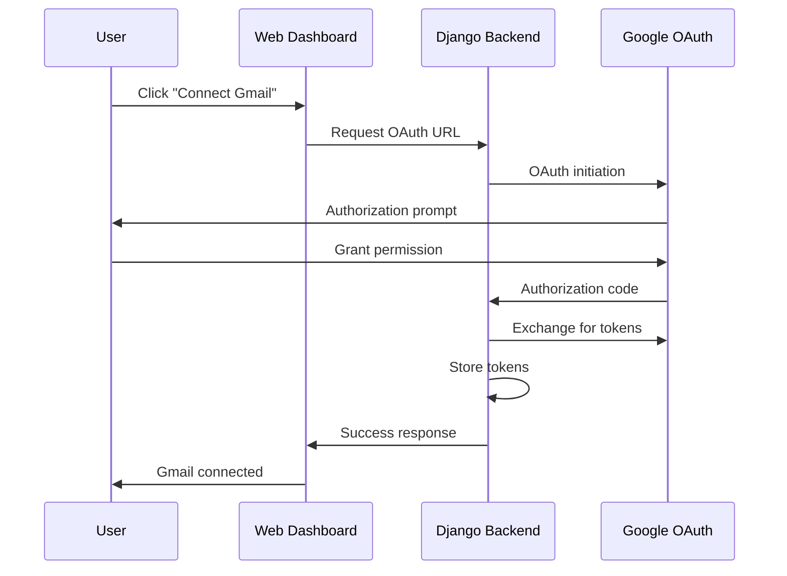
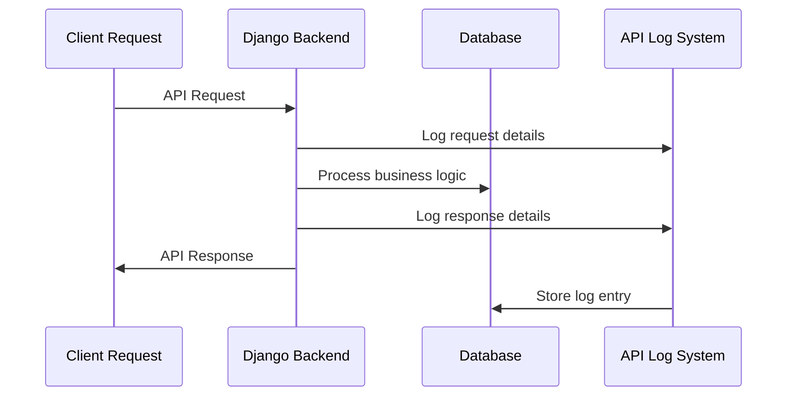
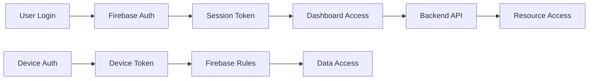
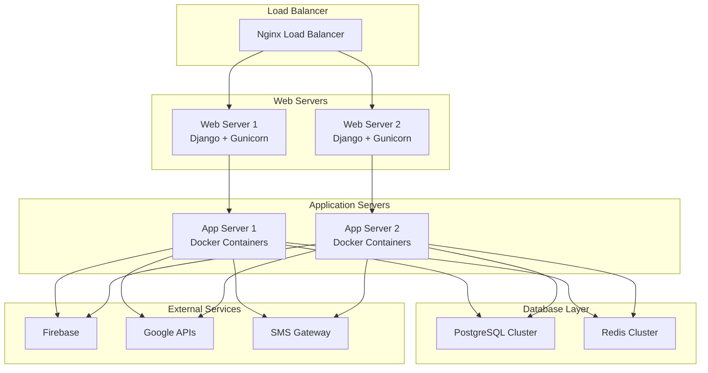

# FastPay System Architecture

This document provides a comprehensive overview of the FastPay system architecture, including component interactions, data flows, technology stack, and deployment architecture.

## 📋 Table of Contents

- [High-Level Architecture](#high-level-architecture)
- [Component Overview](#component-overview)
- [Data Flow Architecture](#data-flow-architecture)
- [Technology Stack](#technology-stack)
- [Security Architecture](#security-architecture)
- [Deployment Architecture](#deployment-architecture)
- [Communication Patterns](#communication-patterns)
- [Scalability Considerations](#scalability-considerations)

---

## High-Level Architecture



### System Components

| Layer | Components | Responsibility |
|-------|------------|----------------|
| **Client** | APK, Dashboard, Admin | User interface and device control |
| **API** | Django REST, Firebase SDK | Business logic and data access |
| **Data** | Firebase, PostgreSQL, Redis | Real-time and persistent storage |
| **External** | Gmail, SMS, Telegram | Third-party integrations |

---

## Component Overview

### 1. FastPay APK (Android Application)

**Technology**: Java/Kotlin, Android SDK

**Responsibilities**:
- Execute remote commands from dashboard
- Collect and sync SMS/notifications/contacts
- Maintain real-time connection to Firebase
- Handle device authentication and security
- Report device status and heartbeat

**Key Features**:
- **Command Execution**: 31 remote commands for device control
- **Data Collection**: Real-time SMS, notification, contact sync
- **Heartbeat System**: Lightweight status reporting
- **Security**: Encrypted communication and authentication

### 2. FastPay Dashboard (Web Application)

**Technology**: React 19.2.0, TypeScript, Vite, Tailwind CSS

**Responsibilities**:
- Provide real-time device monitoring interface
- Enable remote command execution
- Display analytics and reporting
- Manage bank card templates
- Handle user authentication and access control

**Key Features**:
- **Real-time Updates**: Firebase-based live data
- **Smooth Animations**: SectionAnimator system
- **Template Management**: Bank card template CRUD
- **API Logging**: Enhanced filtering and monitoring

### 3. FastPay Backend (Django REST API)

**Technology**: Django 4.x, Django REST Framework, Celery

**Responsibilities**:
- Provide RESTful API endpoints
- Handle Gmail OAuth integration
- Manage bank card templates
- Process API request logging
- Coordinate with external services

**Key Features**:
- **API Endpoints**: Comprehensive REST API
- **Gmail Integration**: OAuth with enhanced error handling
- **Template System**: Bank card template management
- **Logging**: API request tracking with filtering

### 4. Firebase Realtime Database

**Technology**: Google Firebase Realtime Database

**Responsibilities**:
- Real-time data synchronization
- Device-to-dashboard communication
- Command queuing and status tracking
- Real-time analytics data

**Key Features**:
- **Real-time Sync**: Live data updates
- **Scalable**: Handles multiple concurrent connections
- **Secure**: Role-based access controls
- **Reliable**: Built-in conflict resolution

---

## Data Flow Architecture

### 1. Device-to-Dashboard Data Flow



### 2. Gmail OAuth Flow



### 3. API Request Logging Flow



---

## Technology Stack

### Frontend Stack

| Technology | Version | Purpose |
|------------|---------|---------|
| **React** | 19.2.0 | UI framework |
| **TypeScript** | 5.9.3 | Type safety |
| **Vite** | 7.2.4 | Build tool |
| **Tailwind CSS** | 3.x | Styling |
| **Radix UI** | Latest | Component primitives |
| **Firebase SDK** | 12.6.0 | Real-time database |
| **React Router** | 7.12.0 | Navigation |

### Backend Stack

| Technology | Version | Purpose |
|------------|---------|---------|
| **Django** | 4.x | Web framework |
| **Django REST** | 3.x | API framework |
| **PostgreSQL** | 14+ | Primary database |
| **SQLite** | 3.x | Development database |
| **Redis** | 6.x | Cache and queue |
| **Celery** | 5.x | Background tasks |
| **Gunicorn** | 20.x | WSGI server |

### Infrastructure Stack

| Technology | Purpose |
|------------|---------|
| **Docker** | Containerization |
| **Nginx** | Reverse proxy |
| **Firebase** | Real-time database |
| **Google OAuth** | Authentication |
| **SMS Gateway** | Message delivery |
| **Telegram API** | Notifications |

---

## Security Architecture

### 1. Authentication & Authorization



### Security Layers

| Layer | Mechanism | Purpose |
|-------|-----------|---------|
| **Application** | Firebase Authentication | User identity verification |
| **API** | Session-based auth | API access control |
| **Database** | Firebase Security Rules | Data access permissions |
| **Network** | HTTPS/TLS | Encrypted communication |
| **Device** | Device tokens | Secure device identification |

### 2. Data Protection

- **Encryption**: All data in transit encrypted with TLS
- **Access Control**: Role-based permissions (Admin, OTP-only)
- **Data Validation**: Input sanitization and validation
- **Audit Logging**: Comprehensive API request logging
- **Secure Storage**: Sensitive data encrypted at rest

---

## Deployment Architecture

### 1. Production Deployment



### 2. Staging Deployment

- **Single Server**: All components on one server
- **SQLite Database**: For development and testing
- **Local Firebase**: Separate Firebase project
- **Mock Services**: Simulated external APIs

### 3. Container Architecture

```yaml
# docker-compose.yml structure
services:
  web:          # Django application
    image: fastpay-backend
    ports: ["8000:8000"]
  
  db:           # PostgreSQL database
    image: postgres:14
    volumes: ["postgres_data:/var/lib/postgresql/data"]
  
  redis:        # Redis cache
    image: redis:6-alpine
    ports: ["6379:6379"]
  
  nginx:        # Reverse proxy
    image: nginx:alpine
    ports: ["80:80", "443:443"]
    volumes: ["./nginx:/etc/nginx/conf.d"]
```

---

## Communication Patterns

### 1. Real-time Communication

**Firebase Real-time Database** enables:
- **Push Notifications**: Instant data updates
- **Command Queuing**: Remote command execution
- **Status Tracking**: Live device status
- **Data Synchronization**: Multi-client consistency

### 2. REST API Communication

**Django REST Framework** provides:
- **CRUD Operations**: Standard data operations
- **Authentication**: Session-based security
- **Serialization**: Data format consistency
- **Error Handling**: Comprehensive error responses

### 3. External Service Integration

**Third-party APIs**:
- **Gmail OAuth**: Email account integration
- **SMS Gateway**: Message delivery
- **Telegram API**: Notification system

---

## Scalability Considerations

### 1. Horizontal Scaling

- **Web Servers**: Multiple Django instances behind load balancer
- **Database**: Read replicas for read-heavy operations
- **Cache**: Redis cluster for distributed caching
- **Firebase**: Automatically scales with usage

### 2. Performance Optimization

- **Database Indexing**: Optimized query performance
- **Caching Strategy**: Multi-level caching (Redis, Firebase)
- **Connection Pooling**: Efficient database connections
- **Async Processing**: Celery for background tasks

### 3. Monitoring & Observability

- **Application Metrics**: Performance and error tracking
- **Database Monitoring**: Query performance and connections
- **Infrastructure Metrics**: Server resources and network
- **User Analytics**: Usage patterns and behavior

---

## Integration Points

### 1. Firebase Integration

**Real-time Data Paths**:
```
device/{deviceId}/              # Device-specific data
message/{deviceId}/             # SMS messages
notification/{deviceId}/        # Notifications
contact/{deviceId}/             # Contacts
hertbit/{deviceId}/             # Heartbeat data
fastpay/{mode}/{code}/          # Device lists
```

### 2. Backend API Integration

**Key Endpoints**:
```
/api/devices/                   # Device management
/api/messages/                  # SMS operations
/api/notifications/             # Notification management
/api/contacts/                  # Contact operations
/api/bank-card-templates/      # Template management
/api/api-request-logs/         # API logging
/api/gmail/                     # Gmail integration
```

### 3. External Service Integration

**Third-party APIs**:
- **Google OAuth 2.0**: Gmail account access
- **SMS Gateway**: Message delivery services
- **Telegram Bot API**: Notification delivery

---

## Future Architecture Considerations

### 1. Microservices Migration

- **Service Decomposition**: Split monolithic backend
- **API Gateway**: Centralized API management
- **Service Mesh**: Inter-service communication
- **Event Sourcing**: Audit trail and event replay

### 2. Enhanced Security

- **Zero Trust**: Enhanced security model
- **Multi-factor Auth**: Additional authentication layers
- **Data Encryption**: End-to-end encryption
- **Compliance**: GDPR and other regulations

### 3. Advanced Features

- **Machine Learning**: Predictive analytics
- **Advanced Monitoring**: AIOps integration
- **Multi-tenancy**: Support for multiple organizations
- **Global Deployment**: Multi-region deployment

---

*This architecture document serves as the foundation for understanding the FastPay system's design and implementation decisions. All architectural changes should be reflected in this document.*
