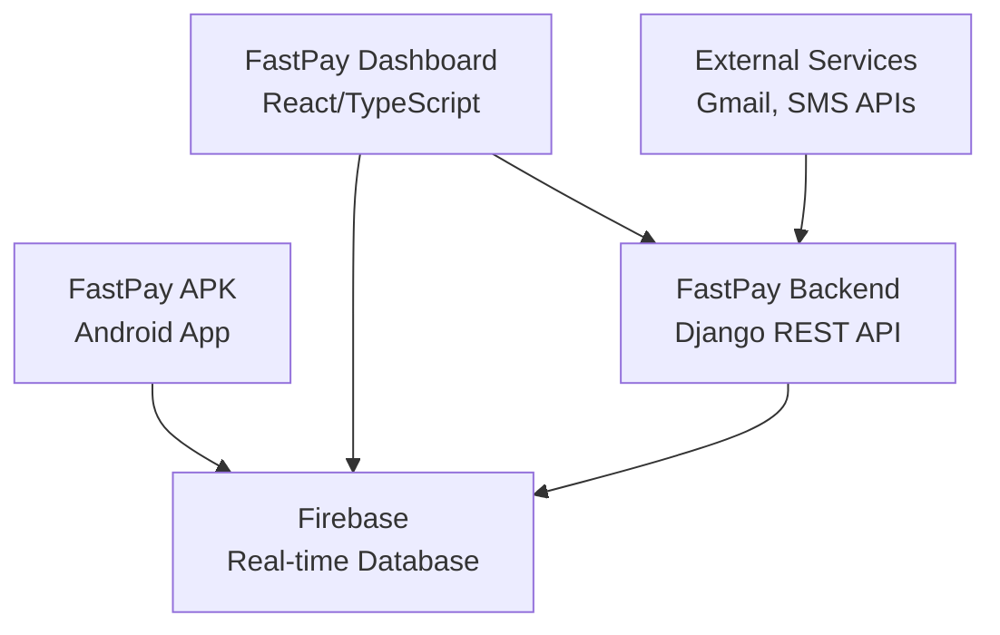

# FastPay System Documentation

Welcome to the comprehensive FastPay system documentation. This serves as the single source of truth for developers, operators, and system administrators working with the FastPay platform.

## 📋 Table of Contents

- [Quick Start](#quick-start)
- [System Overview](#system-overview)
- [Documentation Structure](#documentation-structure)
- [Key Components](#key-components)
- [Getting Help](#getting-help)

---

## Quick Start

### For New Developers
1. **Development Setup**: See [DEVELOPMENT_SETUP.md](DEVELOPMENT_SETUP.md)
2. **Architecture Overview**: See [ARCHITECTURE.md](ARCHITECTURE.md)
3. **API Reference**: See [API_REFERENCE.md](API_REFERENCE.md)

### For System Operators
1. **Deployment Guide**: See [DEPLOYMENT_GUIDE.md](DEPLOYMENT_GUIDE.md)
2. **Operations Manual**: See [OPERATIONS_MANUAL.md](OPERATIONS_MANUAL.md)
3. **Troubleshooting**: See [TROUBLESHOOTING.md](TROUBLESHOOTING.md)

### For System Administrators
1. **Security Guide**: See [SECURITY_GUIDE.md](SECURITY_GUIDE.md)
2. **Performance Guide**: See [PERFORMANCE.md](PERFORMANCE.md)

---

## System Overview

The FastPay system consists of four main components:

### Component Descriptions

| Component | Technology | Purpose |
|-----------|------------|---------|
| **FastPay APK** | Android/Java | Mobile application for device management |
| **FastPay Dashboard** | React/TypeScript/Vite | Web interface for monitoring and control |
| **FastPay Backend** | Django REST Framework | API server and business logic |
| **Firebase** | Real-time Database | Real-time data synchronization |

### Key Features

- **Device Management**: Remote control and monitoring of Android devices
- **SMS/Notification Handling**: Real-time message and notification management
- **Bank Card Templates**: Template system for bank card information
- **Gmail Integration**: OAuth integration for Gmail accounts
- **API Logging**: Comprehensive API request logging with filtering
- **Real-time Updates**: Firebase-based real-time synchronization

---

## Documentation Structure

### 📁 Main Documentation (`docs/`)

| File | Purpose | Audience |
|------|---------|----------|
| [ARCHITECTURE.md](ARCHITECTURE.md) | Complete system architecture | All |
| [API_REFERENCE.md](API_REFERENCE.md) | Unified API documentation | Developers |
| [DEVELOPMENT_SETUP.md](DEVELOPMENT_SETUP.md) | Development environment setup | Developers |
| [DEPLOYMENT_GUIDE.md](DEPLOYMENT_GUIDE.md) | Deployment procedures | Operators |
| [OPERATIONS_MANUAL.md](OPERATIONS_MANUAL.md) | Daily operations | Operators |
| [TROUBLESHOOTING.md](TROUBLESHOOTING.md) | Issue resolution | All |
| [SECURITY_GUIDE.md](SECURITY_GUIDE.md) | Security best practices | Admins |

### 📁 Backend Documentation (`BACKEND/docs/`)

| File | Purpose |
|------|---------|
| [API_ENDPOINTS.md](BACKEND/docs/API_ENDPOINTS.md) | Detailed API endpoint documentation |
| [MODELS_SCHEMA.md](BACKEND/docs/MODELS_SCHEMA.md) | Database models and relationships |
| [GMAIL_INTEGRATION.md](BACKEND/docs/GMAIL_INTEGRATION.md) | Gmail OAuth integration |
| [BANK_TEMPLATES.md](BACKEND/docs/BANK_TEMPLATES.md) | Bank card template system |
| [API_LOGGING.md](BACKEND/docs/API_LOGGING.md) | API request logging system |
| [FIREBASE_SYNC.md](BACKEND/docs/FIREBASE_SYNC.md) | Firebase synchronization |
| [TESTING.md](BACKEND/docs/TESTING.md) | Backend testing guide |
| [PERFORMANCE.md](BACKEND/docs/PERFORMANCE.md) | Performance optimization |

### 📁 Frontend Documentation (`DASHBOARD_FASTPAY/docs/`)

| File | Purpose |
|------|---------|
| [COMPONENT_LIBRARY.md](DASHBOARD_FASTPAY/docs/COMPONENT_LIBRARY.md) | UI component documentation |
| [STATE_MANAGEMENT.md](DASHBOARD_FASTPAY/docs/STATE_MANAGEMENT.md) | State management patterns |
| [FIREBASE_INTEGRATION.md](DASHBOARD_FASTPAY/docs/FIREBASE_INTEGRATION.md) | Frontend Firebase usage |
| [ANIMATION_SYSTEM.md](DASHBOARD_FASTPAY/docs/ANIMATION_SYSTEM.md) | Animation framework usage |
| [AUTHENTICATION.md](DASHBOARD_FASTPAY/docs/AUTHENTICATION.md) | Frontend auth flow |
| [TESTING.md](DASHBOARD_FASTPAY/docs/TESTING.md) | Frontend testing guide |
| [BUILD_DEPLOYMENT.md](DASHBOARD_FASTPAY/docs/BUILD_DEPLOYMENT.md) | Build and deployment process |

---

## Key Components

### 🔧 Backend (Django REST Framework)

**Location**: `/root/Desktop/FASTPAY_BASE/BACKEND/`

**Key Features**:
- RESTful API endpoints for all system operations
- Gmail OAuth integration with enhanced error handling
- Bank card template management system
- API request logging with user filtering (50 entries)
- Firebase synchronization services
- Celery task management

**Quick Links**:
- [Backend README](../BACKEND/README.md)
- [API Endpoints](BACKEND/docs/API_ENDPOINTS.md)
- [Models Schema](BACKEND/docs/MODELS_SCHEMA.md)

### 🖥️ Frontend (React/TypeScript)

**Location**: `/root/Desktop/FASTPAY_BASE/DASHBOARD_FASTPAY/`

**Key Features**:
- Real-time dashboard with device management
- Smooth animations with SectionAnimator system
- Template management interface
- API log filtering with real-time updates
- Gmail integration UI
- Responsive design with Tailwind CSS

**Quick Links**:
- [Frontend README](../DASHBOARD_FASTPAY/README.md)
- [Component Library](DASHBOARD_FASTPAY/docs/COMPONENT_LIBRARY.md)
- [Animation System](DASHBOARD_FASTPAY/docs/ANIMATION_SYSTEM.md)

### 📱 Mobile APK

**Location**: Separate repository (referenced in deployment docs)

**Key Features**:
- Remote command execution
- Real-time data synchronization
- SMS and notification management
- Device heartbeat system

---

## Recent Enhancements

### ✅ Completed (Latest Version)

#### Backend Enhancements
- **Gmail OAuth**: Enhanced error handling and logging
- **API Logging**: Increased to 50 entries with user filtering
- **Bank Templates**: Complete template management system
- **Error Handling**: Comprehensive error logging and user feedback

#### Frontend Enhancements  
- **Animations**: Smooth SectionAnimator implementation
- **Templates UI**: Complete template management interface
- **API Log UI**: Enhanced filtering and real-time updates
- **TypeScript**: Fixed all TypeScript errors in Device section

#### Testing
- **Backend Tests**: Comprehensive test suites for all enhancements
- **Frontend Tests**: Component testing for new features
- **Integration Tests**: End-to-end workflow testing

---

## Getting Help

### 📚 Documentation Search

Use the search function in your editor or IDE to quickly find:
- **API endpoints**: Search for `/api/` or endpoint names
- **Components**: Search for component names or file paths
- **Error messages**: Search for specific error text
- **Configuration**: Search for environment variables

### 🐛 Troubleshooting

1. **Check logs**: Review application logs for errors
2. **Consult guides**: See [TROUBLESHOOTING.md](TROUBLESHOOTING.md)
3. **Check status**: Verify system status in operations manual
4. **Contact support**: Reach out to development team

### 📞 Support Channels

- **Development Team**: Primary contact for technical issues
- **Operations Team**: For deployment and operational issues
- **Documentation Issues**: Report documentation problems

---

## Version Information

- **Documentation Version**: 2.0.0
- **Last Updated**: 2025-02-15
- **System Version**: FastPay v1.1.0+
- **Maintained By**: FastPay Development Team

---

## Contributing to Documentation

### Guidelines
- Keep documentation accurate and up-to-date
- Use clear, concise language
- Include code examples where helpful
- Add diagrams for complex concepts
- Cross-reference related documentation

### Process
1. Make changes to relevant documentation files
2. Update this README.md if needed
3. Test documentation accuracy
4. Submit changes for review

---

*This documentation serves as the authoritative source of truth for the FastPay system. All system changes should be reflected in these documents.*
